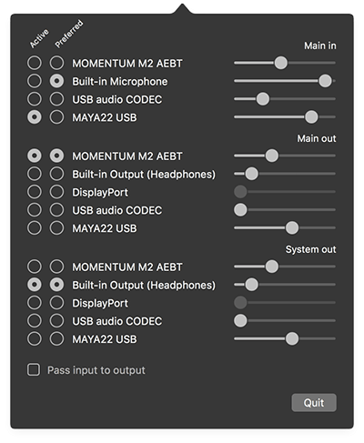

# AudioSelector

AudioSelector is a [free](./LICENSE.md) menu bar application, helping with managing the audio interfaces of your Mac.

You can download the newest version in the **Release** section.

## Functionality

AudioSelector shows the complete list of all devices for audio in- and output, as well as for system output.
You can easily manage the audio levels using the sliders and select the active device to be used.

Furthermore, you can select what your preferred devices are for in and output.
AudioSelector will make sure your preferred devices will stay active when the hardware changes.
This comes in handy when a new device is added (e.g. monitor or bluetooth headphones are connected), as by default the macOS will try to switch to the newly connected device.

As an added bonus, you can pass the audio of the input device to the output device. A feature like that usually only comes with payed, specialised audio application.
